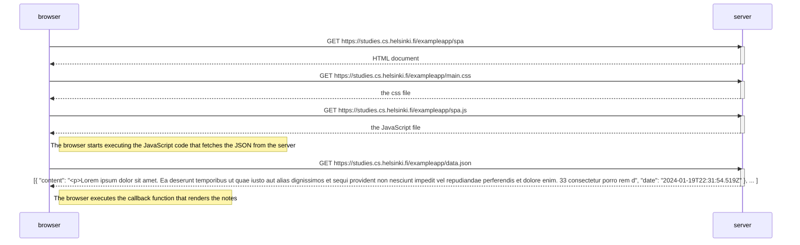

```mermaid
sequenceDiagram
    participant browser
    participant server

    browser->>server: GET https://studies.cs.helsinki.fi/exampleapp/spa
    activate server
    server-->>browser: HTML document
    deactivate server

    browser->>server: GET https://studies.cs.helsinki.fi/exampleapp/main.css
    activate server
    server-->>browser: the css file
    deactivate server

    browser->>server: GET https://studies.cs.helsinki.fi/exampleapp/spa.js
    activate server
    server-->>browser: the JavaScript file
    deactivate server

    Note right of browser: The browser starts executing the JavaScript code that fetches the JSON from the server

    browser->>server: GET https://studies.cs.helsinki.fi/exampleapp/data.json
    activate server
    server-->>browser: [{ "content": "<p>Lorem ipsum dolor sit amet. Ea deserunt temporibus ut quae iusto aut alias dignissimos et sequi provident non nesciunt impedit vel repudiandae perferendis et dolore enim. 33 consectetur porro rem d", "date": "2024-01-19T22:31:54.519Z" }, ... ]
    deactivate server

    Note right of browser: The browser executes the callback function that renders the notes
```
